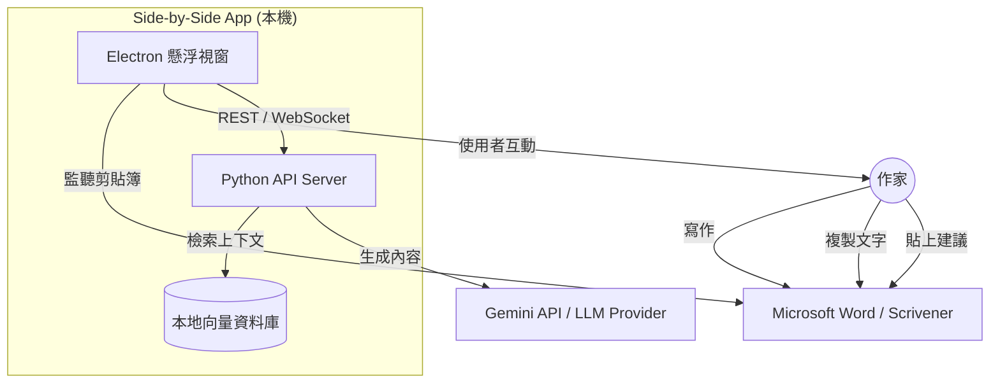

# 系統架構：AI 寫作伴侶 (Side-by-Side 版)

**專案：** Side-by-Side Companion App
**版本：** 0.1 (架構初稿)
**作者：** Winston (系統架構師)

---

## 1. 架構策略 ("混合式" 途徑)

為了滿足 **「永遠置頂 (Always-on-Top)」** 的核心需求，同時保持強大的 AI 能力，我們將採用 **混合桌面架構 (Hybrid Desktop Architecture)**。

*   **前端 (門面)：** **Electron + Next.js**。
    *   *原因：* 瀏覽器無法強制自行置頂於其他視窗（如 Word）之上。Electron 對於客製化「懸浮視窗」體驗與原生的剪貼簿 API 存取是必須的。
*   **後端 (大腦)：** **Python (FastAPI)**。
    *   *原因：* Python 是 AI/RAG (LangChain, ChromaDB) 的原生語言。它允許我們有效地處理大量文本並管理嵌入向量。

### 1.1 "本地優先" 承諾
為了解決亞洲市場對隱私（"AI 味"）的敏感度：
*   **本地資料庫：** 所有 RAG 索引 (ChromaDB) 皆儲存於本地。
*   **本地編排：** Python 後端運行於 `localhost`。
*   **API 串接：** 僅最終的提示詞 (Prompt) 會發送給 LLM (Gemini)，未來可提供 "本地 LLM" 切換選項 (如 Ollama)。

---

## 2. 系統環境圖 (C4 Level 1)

---

## 3. 元件架構

### 3.1 前端 (Electron + Next.js)
*   **框架：** Electron 搭配 Next.js (靜態導出或自定義伺服器)。
*   **UI 函式庫：** `shadcn/ui` (Tailwind CSS) 以打造乾淨、無干擾的美學。
*   **關鍵模組：**
    *   `ClipboardManager`：輪詢或監聽系統剪貼簿變更。
    *   `WindowController`：管理「永遠置頂」、調整大小與透明度 (幽靈模式)。
    *   `PersonaSelector`：切換「編劇」、「讀者」與「編輯」角色的 UI。

### 3.2 後端 (Python FastAPI)
*   **框架：** FastAPI (高效能，易於處理非同步 AI 任務)。
*   **AI 編排器：** `LangChain` 或原生的 Google Generative AI SDK。
*   **RAG 引擎：**
    *   *擷取 (Ingestion)：* 解析使用者專案資料夾中的 `.txt`, `.md`, `.docx` (未來)。
    *   *儲存 (Storage)：* `ChromaDB` (持久化本地儲存)。
    *   *檢索 (Retrieval)：* 混合搜尋 (關鍵字 + 語意)。

---

## 4. 資料流：「感知上下文」迴圈

「上下文遺失」是最大痛點之一。我們解決它的方式如下：

1.  **擷取 (一次性/定期)：** 使用者將 App 指向他們的「世界觀聖經」資料夾。後端將資料分塊並嵌入至 `ChromaDB`。
2.  **觸發：** 使用者在 Scrivener 中複製一段落。
3.  **捕捉：** Electron 偵測到剪貼簿變更 -> "偵測到新文本"。
4.  **查詢：** 使用者點擊 "詢問 AI 編輯"。
5.  **上下文組裝 (後端)：**
    *   接收輸入文本。
    *   *自查詢 (Self-Query)：* 「這段文字裡有誰？」
    *   *檢索 (Retrieval)：* 抓取特定名稱的角色卡。
6.  **生成：** 發送 `[系統提示詞 + 檢索到的角色卡 + 使用者文本]` 至 Gemini。
7.  **回應：** AI 回答時具備完整的上下文意識。

### 4.1 動態上下文同步 (Dynamic Context Synchronization)
這正是您的擔憂所在：「如果我改了設定，AI 還記得嗎？」
我們的解決方案是 **「雙向同步 (Dual-Sync)」**：

1.  **被動監聽 (File Watcher):**
    *   Side-by-Side App 會持續監聽您的「世界觀聖經」資料夾 (例如 Obsidian 的 Vault)。
    *   一旦您在外部編輯器修改了 `角色卡.md` 並存檔，Side-by-Side 會在背景自動觸發 **增量重編入 (Incremental Re-indexing)**，更新 ChromaDB。
    *   **結果：** 下一次對話時，AI 已經知道新的設定了。

2.  **主動更新 (In-App Update):**
    *   如果 AI 建議：「這裡的魔法規則應該改成...」，您可以直接在 Side-by-Side 的介面點擊「更新設定」。
    *   App 會同時寫入 `魔法規則.md` 檔案並更新資料庫。

---

## 5. 技術堆疊決策

| 層級 | 技術 | 決策理由 |
| :--- | :--- | :--- |
| **App 執行環境** | **Electron** | 「永遠置頂」與原生剪貼簿存取所需。 |
| **UI 框架** | **Next.js + Tailwind** | 快速開發，美觀的 UI 元件。 |
| **後端 API** | **FastAPI** | 基於標準 (OpenAPI)，快速，Python 生態系。 |
| **資料庫** | **ChromaDB** | 簡單、本地、基於檔案的向量儲存。 |
| **LLM** | **Google Gemini 2.5 flash** | 高上下文視窗 (對小說至關重要)，具成本效益。目前使用gemini api即可連通的語言模型 |
| **套件管理** | **Poetry (Py) / Bun (JS)** | 現代化，鎖定檔可靠性。 |

---

## 6. 安全與隱私策略
*   **剪貼簿安全：** 僅在使用者 *聚焦* App 或明確 *啟用* 「自動監聽」模式時處理剪貼簿內容。針對偏執用戶預設為手動貼上。
*   **金鑰管理：** 使用者 API Key 儲存於系統鑰匙圈 (System Keychain) 中（非純文字），或加密的本地設定檔。

## 7. 下一步 (開發路線圖)
1.  **專案骨架：** 建立 Electron-Next-FastAPI Monorepo。
2.  **原型 "懸浮視窗"：** 證明「永遠置頂」視窗在 Word 上運作順暢。
3.  **原型 "大腦"：** 將簡易的 RAG 流程連接至 UI。
